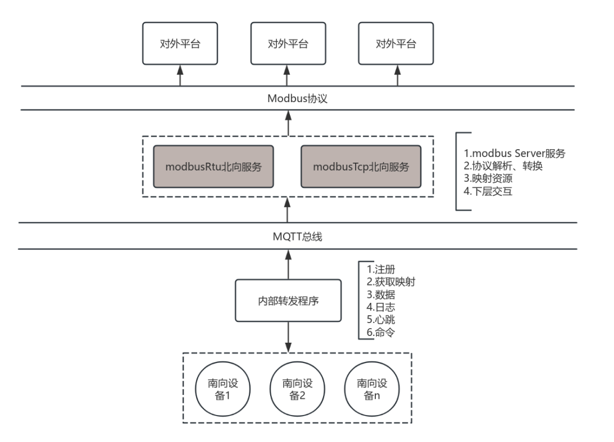
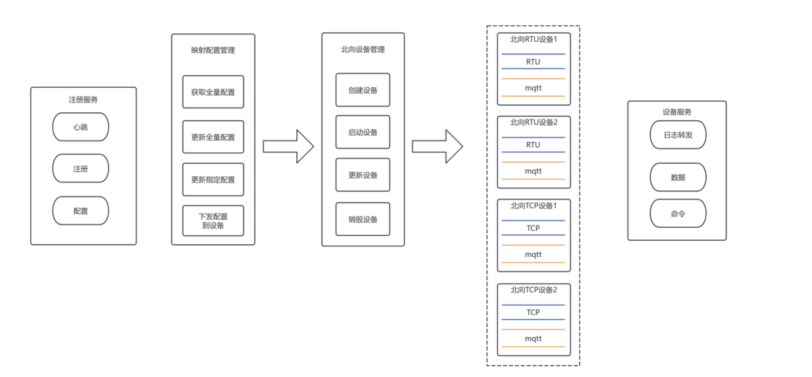

# CLAUDE.md

This file provides guidance to Claude Code (claude.ai/code) when working with code in this repository.

## 项目概述

这是一个 边缘代理节点 北向应用服务模板，用于 Modbus 通信（app-modbus-go）。它设计为可复用的模板，可以将 "modbus" 替换为其他服务名称来创建新的 边缘代理 北向应用服务。

边缘物联代理需要为北向用户提供Modbus协议接入，主要功能是进行规约转换，大致内容为，对外支持modbus协议访问指定北向资源，对内通过与南向转发程序使用mqtt交互，获取北向映射到南向设备数据，最终将数据再转回modbus协议，返还给用户。

## 总体架构



## 模块设计



## 构建和运行命令

### 本地开发

```bash
# 清理并构建（当前架构）
make clean
make

# 构建特定架构
make build-arm64
make build-amd64

# 本地运行（从项目根目录执行，二进制文件在 cmd/ 目录下）
cd cmd/
./app-modbus-go -o -d -cp
```

### Docker 开发

```bash
# 首先启动 EdgeX 核心服务
cd cmd/docker-compose
docker compose -f docker-compose-core.yml up -d

# 构建并运行本服务的 Docker 容器
cd ../..  # 返回项目根目录
make clean
make build-arm64  # 或 build-amd64
make docker-arm64  # 或 docker-amd64
cd cmd/docker-compose
docker compose -f docker-compose-modbus.yml up
```

### 测试

```bash
# 运行所有测试
go test ./...

# 运行特定包的测试
go test ./internal/pkg/logger
go test ./internal/pkg/modbusserver

# 运行特定测试函数
go test ./internal/pkg/logger -run TestLoggerCreation

# 带覆盖率的测试
go test -cover ./...
```

## 架构设计

### 服务生命周期

应用遵循标准的启动模式：
1. `cmd/main.go` - 入口点，调用 `startup.BootStrap()`
2. `internal/pkg/startup/bootstarp.go` - 创建并初始化 `AppService`
3. `internal/pkg/service/service.go` - 主服务编排器，管理所有组件

### 核心组件（基于接口的设计）

架构对所有主要组件使用接口，定义在各自的 `interface.go` 文件中：

**AppService** (`internal/pkg/service/`) - 中心服务编排器，管理：
- **LoggingClient** - 结构化日志记录
- **DeviceManager** - 设备生命周期管理
- **MappingManager** - 数据映射/转换
- **ModbusServer** - Modbus 协议处理
- **Register** - 服务注册

**组件职责划分：**

| 组件 | 位置 | 用途 |
|------|------|------|
| Service | `internal/pkg/service/` | 核心编排器，管理生命周期 |
| Logger | `internal/pkg/logger/` | 集中日志记录（支持多级别） |
| Device Manager | `internal/pkg/devicemanager/` | 设备注册/管理 |
| Mapping Manager | `internal/pkg/mappingmanager/` | 北向属性映射到南向属性操作 |
| Modbus Server | `internal/pkg/modbusserver/` | Modbus TCP/RTU 通信 |
| MQTT Pipe | `internal/pkg/mqttfuncPipe/` | 基于管道的 MQTT 处理 |
| Register | `internal/pkg/register/` | 向数据中心注册北向服务 |

### 配置系统

主配置文件：`cmd/res/configuration.yaml`

关键配置节：
- `Writable.LogLevel` - 运行时日志级别（TRACE, DEBUG, INFO, WARN, ERROR）
- `Service` - HTTP API 端点配置（默认端口：59711）
- `MessageBus` - MQTT 代理连接设置
  - `BaseTopicPrefix` - 主题前缀（默认：v1）
  - `Optional.ClientId` - MQTT 客户端 ID
- `Trigger` - 消息主题配置
  - `SubscribeTopics` - 订阅的主题（支持 MQTT 通配符，如 `data/+`）
  - `PublishTopic` - 发布的主题
- `AppCustom` - 服务特定设置
  - `Pipelines.Topics` - 自定义数据处理流水线主题

### MQTT 功能管道（MqttFuncPipe）

这是一个关键的设计模式：
- 声明式的主题到处理器映射
- 线程安全的功能管道与步骤
- 工作池模式（可配置工作线程数）
- 自动 MQTT 订阅和消息路由
- 基于超时的任务执行

### 模板使用方式

这是一个模板仓库。要创建新服务：
1. 将所有 `app-modbus-go` 替换为 `app-[新服务名]-go`
2. 将所有 `modbus` 替换为 `[新服务名]`
3. 更新 `cmd/res/configuration.yaml` 中的服务特定主题和设置
4. 在组件包中实现服务特定逻辑

### 构建系统特点

- CGO_ENABLED=0 生成静态二进制文件
- 多架构支持（arm64/amd64）
- 使用 Docker buildx 的多平台构建
- 版本从 VERSION 文件读取，git SHA 嵌入 Docker 标签
- 中国镜像加速（Aliyun 和 GOPROXY）


## 项目结构

```
app-modbus-go/
├── cmd/
│   ├── main.go                      # 应用入口
│   ├── docker-run.sh                # Docker 启动脚本
│   ├── docker-compose/              # Docker Compose 配置
│   │   ├── docker-compose-core.yml  # 核心服务
│   │   └── docker-compose-demo.yml  # 演示配置
│   └── res/
│       └── configuration.yaml       # 服务配置文件
├── internal/pkg/
│   ├── config/                      # 配置管理
│   ├── devicemanager/               # 设备操作接口
│   ├── logger/                      # 日志系统
│   ├── mappingmanager/              # 数据映射操作
│   ├── modbusserver/                # Modbus 协议处理器
│   ├── mqttfuncPipe/                # 基于管道的 MQTT 处理
│   ├── register/                    # 服务注册
│   ├── service/                     # 核心服务编排器
│   └── startup/                     # 启动引导
├── Dockerfile                       # 多阶段 Docker 构建
├── Makefile                         # 构建自动化
├── go.mod & go.sum                  # Go 依赖
├── version.go                       # 版本管理
└── README.md                        # 项目文档
```

## 关键文件说明

- `cmd/main.go` - 应用程序入口点
- `version.go` - 版本字符串（由 Makefile 在构建时替换）
- `internal/pkg/service/service.go` - 主服务实现
- `internal/pkg/startup/bootstarp.go` - 启动引导逻辑
- `cmd/res/configuration.yaml` - 运行时配置
- `Makefile` - 构建目标和 Docker 镜像创建
- `Dockerfile` - 基于 Alpine 的多阶段构建

## 依赖项

- Go 1.25
- `github.com/eclipse/paho.mqtt.golang v1.5.0` - MQTT 客户端
- `github.com/stretchr/testify v1.10.0` - 测试框架
