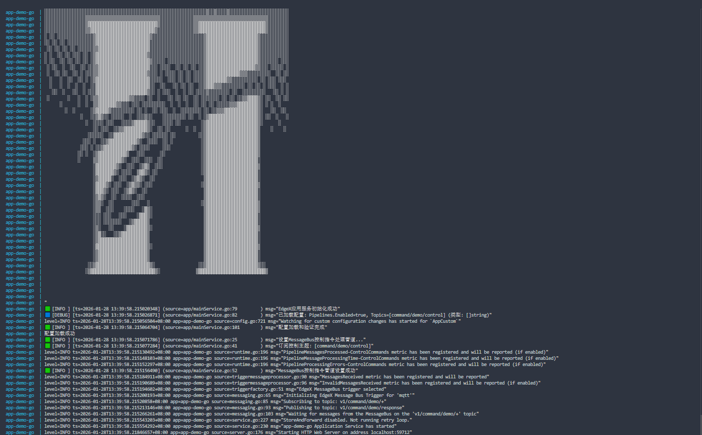

# EdgeX 应用服务开发modbus

## 1.命名规则

`
app-[服务名]-go
`

## 2.开发指导
### 2.1 命名替换
- 将所有的`app-modbus-go`替换为`app-[服务名]-go`
- 将所有的`modbus`替换为`[服务名]`


### 2.2 本地运行测试
```bash
make clean

make

cd cmd/

./app-[服务名]-go
```

### 2.3 docker启动测试
```bash
make clean

make build-[amd64 or arm64]

make docker-[amd64 or arm64]

cd cmd/docker-compose

docker compose -f docker-compose-modbus.yml up
```
